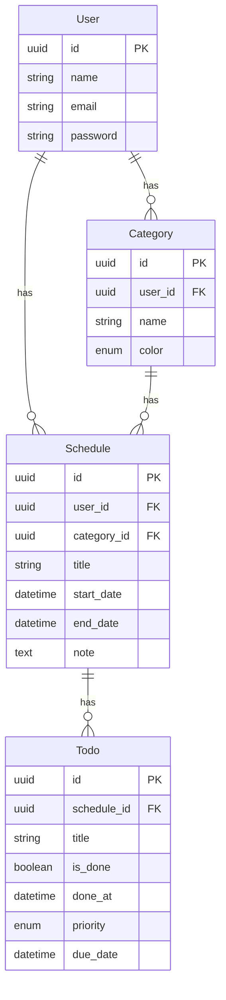

# 予定 × ToDo管理アプリ (個人利用版)

## 1. アプリの目的・使用技術・デプロイ先
**アプリの目的**  
- 個人利用を前提とした「予定とToDoを一元管理」できるアプリ  
- 「予定の中に複数のToDoがある」構造を採用  
- 完了済みタスクは30日保持 → 復元可能 / 自動削除でシンプル管理  
- 学習目的として API駆動 (FastAPI + React) を採用  

**使用技術**  
- Backend: FastAPI + SQLAlchemy  
- Frontend: React + UIライブラリ (MUI / Vuetify)  
- DB: PostgreSQL（開発環境から本番同等を想定）  
- カレンダーUI: FullCalendar.js  
- 認証: JWT（学習目的で導入）  
- 定期削除: APScheduler  

**デプロイ先**  
- Backend: Render / Railway  
- Frontend: Vercel / Netlify  
- DB: PostgreSQL（クラウドホスティング）

---

## 2. データベース設計・モデル設計
**ER図（Mermaid表記）**  

**モデル詳細**
	•	User
	•	id, name, email, password
	•	Category
	•	id, user_id(FK), name, color(enum: red/blue/green/yellow/purple)
	•	Schedule (予定)
	•	id, user_id(FK), category_id(FK), title, start_date(datetime), end_date(datetime), note
	•	Todo
	•	id, schedule_id(FK), title, is_done(boolean), done_at(datetime), priority(enum 1〜5, 制限あり), due_date(optional)

⸻

3. API設計・エンドポイント設計

認証
	•	POST /auth/signup - ユーザー登録
	•	POST /auth/login - ログイン（JWT発行）
	•   POST /auth/refresh - リフレッシュ

Category
	•	GET /categories - カテゴリ一覧
	•	POST /categories - カテゴリ作成
	•	PUT /categories/{id} - カテゴリ更新
	•	DELETE /categories/{id} - カテゴリ削除

Schedule
	•	GET /schedules - 予定一覧
	•	POST /schedules - 予定作成
	•	GET /schedules/{id} - 予定詳細
	•	PUT /schedules/{id} - 予定更新
	•	DELETE /schedules/{id} - 予定削除

Todo
	•	POST /schedules/{id}/todos - タスク追加
	•	PUT /todos/{id} - タスク更新（完了/復元含む）
	•	DELETE /todos/{id} - タスク削除

完了済みタスク
	•	GET /schedules/{id}/done_todos - 30日以内の完了済みタスク一覧
	•	内部処理: APSchedulerで30日以上経過したタスクを自動削除

⸻

4. UI設計

トップページ（カレンダー）
	•	FullCalendarで予定を表示
	•	日付クリックで予定一覧を表示
	•	予定クリックで詳細ページへ遷移

予定詳細ページ
	•	予定情報（タイトル/日付/カテゴリ色）
	•	未完了タスク一覧（チェックボックス形式）
	•	タスク追加ボタン
	•	「完了済みタスクを見る」リンク

完了済みタスクページ
	•	対象予定に紐づく完了済みタスク一覧（30日以内）
	•	各タスクに「復元」ボタン
	•	注意文「30日を過ぎたタスクは自動削除されます」

カテゴリ管理ページ
	•	カテゴリ一覧表示
	•	新規カテゴリ作成（名前＋色パレットから選択）

⸻

今後の拡張
	•	完了タスク履歴のレポート化（達成率やグラフ化）
	•	AIによる自動スケジューリング（別アプリで予定）
	•	モバイルUI最適化（モーダル表示対応）
	•	将来的に別アプリと連携（共有・マネタイズ向け）

5. フォルダ構成
schedule_app
	backend/
	└── app/
		├── main.py             # エントリーポイント
		├── core/               # 設定, DB接続, 共通処理
		│   ├── config.py
		│   └── database.py
		├── models/             # SQLAlchemyモデル
		│   ├── user.py
		│   └── category.py
		|	├── schedule.py
		│   └── todo.py
		├── schemas/            # Pydanticスキーマ
		│   ├── user.py
		│   └── category.py
		|	├── schedule.py
		│   └── todo.py
		├── api/                # ルーター (エンドポイント)
		│   ├── user.py
		│   └── category.py
		|	├── schedule.py
		│   └── todo.py
		├── crud/               # DB操作（Create/Read/Update/Delete）
		│   ├── user.py
		│   └── category.py
		|	├── schedule.py
		│   └── todo.py
		└── __init__.py
	frontend/
	└── src/
		├── features/
		│   ├── schedule/
		│   │   ├── components/   # カレンダーUIなど
		│   │   ├── api/          # fetch("/schedule/...")
		│   │   └── hooks/
		│   └── todo/
		│       ├── components/
		│       ├── api/
		│       └── hooks/
		├── shared/               # 共通部品（Button, Modalなど）
		├── App.tsx
		└── main.tsx

		