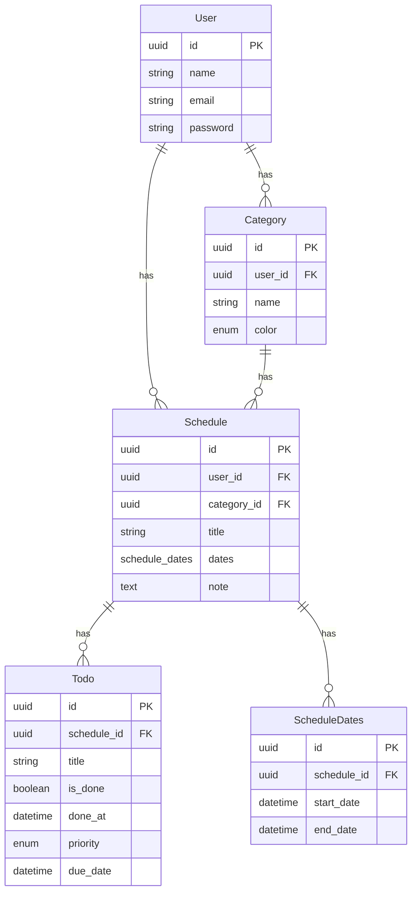

# 予定 × ToDo 管理アプリ (個人利用版)

## 1. プロダクト概要（What / Why）

このアプリは、複数日にまたがる不規則な予定を、１つの画面でまとめて登録できるスケジュール管理サービスです。一般的なカレンダーアプリでは、繰り返し予定を使っても「登録 → 個別編集」の 2 段階が必要になり、実際の運用では手間がかかります。特に、曜日が一定していない予定や、飛び飛びの日程を扱う場合には、同じ操作を何度も繰り返す必要があり、私の負担になっていました。

本アプリでは、この問題を解決するために、複数の予定を一度に選択し、そのまま予定として登録できる機能を提供しています。これにより、これまで複数回必要だった作業が 1 回で完了し、予定入力の手間を大きく削減できます。ユーザーは日常のスケジュール管理をより効率よく行うことができます。

## 2. 機能

- ログイン機能（JWT 認証）
- アカウント登録・セキュアなパスワードハッシュ化
- スケジュールの CRUD
- カテゴリ管理（色分け）
- スケジュールに紐づく ToDo

## 3. 技術

**使用技術**

- 言語: Python, javascript
- Backend(フレームワーク): FastAPI + SQLAlchemy
- Frontend(フレームワーク): React + UI ライブラリ (MUI / Vuetify)
- Auth: JWT, webAuthn
- Infra: Docker / Nginx / XServer VPS /
- DB: PostgreSQL（開発環境から本番同等を想定）
- カレンダー UI: FullCalendar.js
- その他: Alembic / SQLAlchemy / MUI /

## 4. アーキテクチャ

- フロント：React + MUI
- API：FastAPI
- DB：PostgreSQL
- リバースプロキシ：Nginx
- Docker Compose で各サービスを統合

## 5. データベース設計・モデル設計

**ER 図（Mermaid 表記）**

## 6. 意識したこと

- バイブコーディングを活用し、早急な実装
- バックエンドは FastAPI、DB は PostgreSQL、Alembic でマイグレーション管理
- フロントは React でコンポーネント分割／UX 改善
- Docker Compose でフルスタックの開発環境を構築
- XServerVPS でのデプロイ

## 7. 学び

- バイブコーディングは早く実装でき、効率がいいこと
- それの活用にはより基礎を磨かなければならない
