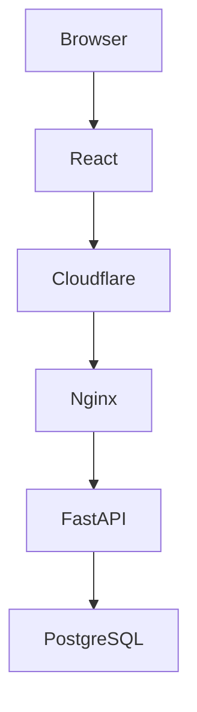
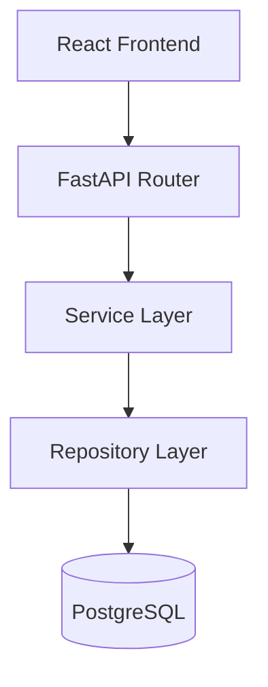
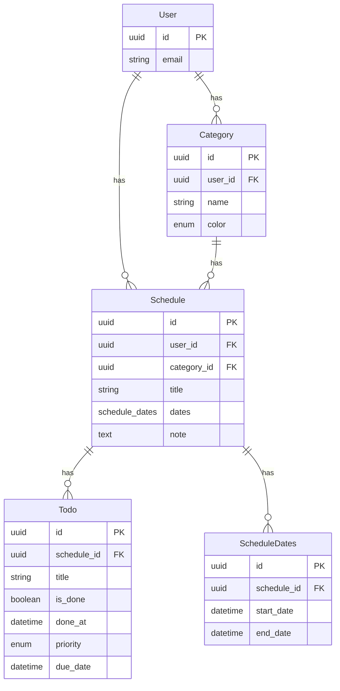

# 予定 × ToDo 管理アプリ (個人利用版)

---

## 1. プロダクト概要（What / Why）

このアプリは、複数日にまたがる不規則な予定を、１つの画面でまとめて登録できるスケジュール管理サービスです。一般的なカレンダーアプリでは、繰り返し予定を使っても「登録 → 個別編集」の 2 段階が必要になり、実際の運用では手間がかかります。特に、曜日が一定していない予定や、飛び飛びの日程を扱う場合には、同じ操作を何度も繰り返す必要があり、私の負担になっていました。

本アプリでは、この問題を解決するために、複数の予定を一度に選択し、そのまま予定として登録できる機能を提供しています。これにより、これまで複数回必要だった作業が 1 回で完了し、予定入力の手間を大きく削減できます。ユーザーは日常のスケジュール管理をより効率よく行うことができます。

シフト表のような画像から予定を読み取る OCR + AI の導入も検討した。

しかし、本アプリはシフト管理専用ではなく、予定の形式が一定でないことや、OCR誤認識の修正作業が発生する可能性を考慮すると、手入力と比較して大きな作業時間削減にはつながらないと判断したため採用しなかった。

---

## 2. 機能

### ベース機能

- パスキーログイン
- スケジュールの CRUD
- カテゴリ管理（色分け）
- スケジュールに紐づく ToDo

### イチオシ機能

- 複数日選択カレンダー: スケジュールを行う日をまとめて選択して、時刻を選択すれば、1〜2回で済む
- 個別時刻編集: 特定の日だけ時刻が違うなどの場合はまとめて登録後、「登録済み日程を見る」から個別で時刻を編集できる
- ミニ月ナビにより、選択した週・日の予定にジャンプできる。週の場合は最左の1-6までのボタン、日の場合はその日のボタンを押す

---

## 3. 技術

### 使用技術

- 言語: Python, javascript
- Backend: FastAPI / SQLAlchemy / Alembic
- Frontend: React / MUI
- Auth: JWT, webAuthn
- Infra: Docker Compose / Nginx / XServer VPS / Cloudflare
- DB: PostgreSQL（開発環境から本番同等を想定）
- カレンダー UI: FullCalendar.js
- Tools: Prettier / ESLint

### 技術選定理由

今回のアプリは個人利用を想定しており、想定データ量も多くないため、
フレームワーク間でのパフォーマンス差は大きな問題にならないと判断した。

そのため、学習目的も兼ねて以前から興味があった技術スタックを採用した。

小規模アプリでは技術選定よりもUXの方が重要と判断した。

- **FastAPI**
  PythonでAPIを構築するモダンなフレームワークであり、
  型ヒントによる開発体験を試したかったため採用。

- **React**
  コンポーネントベースのUI設計を学習する目的で採用。

- **PostgreSQL**
  本番環境でも広く利用されているRDBであり、
  将来的な拡張性を考えて採用。

---

## 4. アーキテクチャ・アプリケーション構成図

### アーキテクチャ


```mermaid
flowchart TD

Browser --> React
React --> Cloudflare
Cloudflare --> Nginx
Nginx --> FastAPI
FastAPI --> PostgreSQL
```

Docker Composeでコンテナ管理

### アプリケーション構成図


```mermaid
flowchart TD

React[React Frontend] --> Router[FastAPI Router]
Router --> Service[Service Layer]
Service --> Repo[Repository Layer]
Repo --> DB[(PostgreSQL)]
```

RouterではHTTP処理のみを行い、ビジネスロジックはService層にまとめました。
これによりAPIの変更と業務ロジックの変更を分離できるようにしています。

---

---

## 5. データベース設計・モデル設計

**ER 図（Mermaid 表記）**


```mermaid
erDiagram
    User ||--o{ Category : has
    User ||--o{ Schedule : has
    Category ||--o{ Schedule : has
    Schedule ||--o{ Todo : has
	  Schedule ||--o{ ScheduleDates : has

    User {
      uuid id PK
      string email
    }

    Category {
      uuid id PK
      uuid user_id FK
      string name
      enum color
    }

    Schedule {
      uuid id PK
      uuid user_id FK
      uuid category_id FK
      string title
	    schedule_dates dates
      text note
    }

	  ScheduleDates {
      uuid id PK
      uuid schedule_id FK
      datetime start_date
      datetime end_date
    }

    Todo {
      uuid id PK
      uuid schedule_id FK
      string title
      boolean is_done
      datetime done_at
      enum priority
      datetime due_date
    }
```

---

## 6. 意識したこと

### APIレスポンス設計

フロントエンドでの処理を簡潔にするため、APIレスポンス形式を統一した。

**Backend Response**

```code
{
  status_code,
  code,
  message
}
```

**Frontend AlertMessage**

```code
{
  type: success | warning | error
  message: string
}
```

これによりフロント側は type に応じて UI 表示を統一できる。

### Git運用

以下のブランチ戦略で開発を行った。

main: 本番
release: テスト環境
feature/_: 機能開発
hotfix/_: 緊急修正

mainブランチは直接編集せず、feature → release → main の流れで管理。

### 開発時に意識したこと

- **API設計の統一**  
  フロントエンドの実装を簡潔にするため、APIレスポンス形式を統一した。

- **開発環境の再現性**  
  開発環境と本番環境の差異を減らすため、Docker Composeでコンテナ管理を行った。

- **開発効率の向上**  
  AIコーディング支援ツール（Codex）を活用しつつ、設計や仕様判断は自身で行った。

- **UI検証の高速化**  
  最初にHTMLモックでUIを検証し、その後Reactコンポーネントに分解することでUI設計と実装を分離した。

- **運用コストの削減**  
  個人開発のため、XServer 無料VPSを利用しインフラコストを抑えた。

---

## 7. 学び

- コーディングエージェントは早く実装でき、効率がいいこと
- それの活用にはより基礎を磨かなければならない
