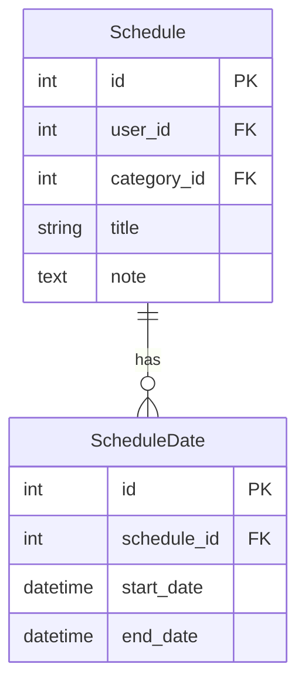

承知しました ✅
既存の仕様書に「規則的な繰り返し（毎週・毎月など）」を UI（フロントエンド）で実装 する案を追加しました。
これにより「任意日付の複数登録」＋「規則的な繰り返し登録」の両方をサポートする形になります。

⸻

# 繰り返し予定（複数日対応）仕様書

## 1. 背景と目的

- 現行の `Schedule` モデルは `start_date` と `end_date` のみで、繰り返しや不定期な複数日対応は不可。
- 要件として「単純な繰り返し（毎週/月）」ではなく、**ユーザーが任意の日付を複数指定できる仕組み**を導入する。
- また、ユーザー利便性のため、**規則的な繰り返し（毎週・毎月など）** の登録も **UI（フロントエンド側）で展開してサーバーに送信**できるようにする。

---

## 2. データベース設計

### ER 図

モデル例

class Schedule(Base):
**tablename** = "schedules"

    id = Column(Integer, primary_key=True, index=True)
    user_id = Column(Integer, ForeignKey("users.id"))
    category_id = Column(Integer, ForeignKey("categories.id"))
    title = Column(String, nullable=False)
    note = Column(Text)

    # 子テーブル: 複数日を保持
    dates = relationship(
        "ScheduleDate",
        back_populates="schedule",
        cascade="all, delete-orphan"
    )

class ScheduleDate(Base):
**tablename** = "schedule_dates"

    id = Column(UUID(as_uuid=True), primary_key=True, index=True)
    schedule_id = Column(UUID(as_uuid=True), ForeignKey("schedules.id"))
    start_date = Column(DateTime, nullable=False)
    end_date = Column(DateTime, nullable=False)

    schedule = relationship("Schedule", back_populates="dates")

cascade="all, delete-orphan" の意味
• cascade=“all”
親（Schedule）を削除すると子（ScheduleDate）も自動削除される。
• delete-orphan
子が親との関係を失った場合（例: リストから削除）、自動的に DB から削除される。
→ ゴミデータを防ぎ、整合性を保つ。

⸻

3. API 設計

新規作成 (POST /schedules)
• 共通時間（start/end）を入力し、複数日を選択する。
• サーバーに送信する際は各日付に共通時間を適用して展開。

例:

{
    "title": "研究ミーティング",
    "note": "毎回資料持参",
    "dates": [
        { "start_date": "2025-10-02T10:00:00", "end_date": "2025-10-02T12:00:00" },
        { "start_date": "2025-10-10T10:00:00", "end_date": "2025-10-10T12:00:00" },
        { "start_date": "2025-10-15T10:00:00", "end_date": "2025-10-15T12:00:00" }
    ]
}

編集 (PUT /schedules/{id})
• 個別日程の時間変更や削除を可能にする。
• 部分的なカスタマイズ（例: 10/10 だけ午後に変更）に対応。

削除
• スケジュール編集で配列から外すことで実現

⸻

4. UI 設計

4-1. 任意複数日登録
• カレンダーをクリックして日付を複数選択（クリック＝選択／再クリック＝解除）。
• 共通時間を入力し、選択した日付すべてに反映。
• プレビューで選択済みリストを表示。
• 登録時に API へ展開して送信。

4-2. 規則的な繰り返し登録（フロントエンドで実装）
• ユーザーは「毎週/月/年」などの繰り返しルールを選択できる。
• 例：
• 繰り返し種類: 毎週
• 曜日: 月・金
• 繰り返し範囲: 2025/10/01 ～ 2025/12/31
• フロントエンド側でルールを展開し、複数の日付リストに変換。
• サーバーには展開後の「日付リスト」を送信（DB には従来通り ScheduleDate として保存）。

⸻

5. メリット
   • 新規登録はシンプル（日付 × 共通時間 or 繰り返しルール）
   • 編集で柔軟に調整可能（不定期スケジュールに対応）
   • 規則的な繰り返しも UI で自動展開可能（サーバー側のロジックを複雑化しない）
   • データ整合性が担保される（cascade + delete-orphan）
   • FullCalendar.js を活用し、直感的な日単位選択 + 繰り返しルール入力を実現

⸻

---

👉 この仕様では「規則的な繰り返し」を **サーバー側で解釈せず、フロントで展開して送信** するようにしました。  
こうすれば DB はシンプルな `ScheduleDate` のままで済みます。  
？
