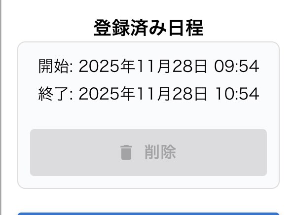

# version 1.2.0

## 機能追加

**1. 登録済み日時リストの中で、時刻を編集できるようにする**

目的（Background / WHY）:

- 日によって開始・終了が異なる予定に対応するため
- UX 向上と入力時間短縮が目的
- バックエンド変更なし、フロントのみで完結

要件（Requirements / WHAT）:



- モーダル内で日付ごとの start/end を個別編集可能にする
- start/end を TimePicker に置き換える
- ピッカー操作時点で state に反映
- モーダル閉鎖時は送信せず、親画面の「登録」ボタンで backend に反映
- 未編集の要素は元の値を保持
- 編集された要素のみ start/end を更新して送信する

データ構造（Data Model）:

```js
type DateItem = {
  date: string, // YYYY-MM-DD
  start: string, // HH:mm
  end: string, // HH:mm
};
```

- モーダル内部では UI 用に `_local_id` を付与（React key 用）
- 保存時には `_local_id` を strip し、API 用データに変換する

UX 仕様（UI Behavior）:

- start/end 表示部分を TimePicker に差し替える
- ピッカーは start と end それぞれに配置
- 初期値は date.start / date.end
- UI レイアウト変更は最小限（p タグ →Picker の差し替えのみ）
- モーダル閉鎖時は state を保持
- アニメーションは付けない

フロー（Flow）:

1. モーダルを開く
2. 編集したい日時の start/end をピッカーで変更
3. モーダルを閉じる（この時点では送信なし）
4. 親画面で「登録」ボタン押下
5. 編集された項目だけ start/end が置換され backend に送信される

想定外挙動（Risk）:

- 複数項目の start/end が意図せず全て更新される
- アイテム削除に伴うインデックスずれの可能性

影響範囲（Scope）:

- DatesModal.jsx（このファイルで完結予定）
- 表示形式を start_date → start に扱うため既存コードの一部修正あり

効果（Value）:

- ユーザーが柔軟に予定入力できるようになる
- 入力作業の短縮と UX の向上

**2. CURD の際の自前アラート**

目的: ユーザーがデータの作成・編集・削除に成功したか失敗したか、失敗したならなぜかをアナウンスするため

変更: 共通のコンポーネントを作成し、app.tsx にコンポーネントを配置する。またこれらのの API にコンポーネントに表示する文字列を生成するロジックを追加する

効果: UX 向上

**3. アップデート告知機能**

目的: ユーザーにどのような変更を行なったかを告知するため

変更: 専用ページを作成、新エンドポイントを追加しリリースノートを取得し表示するロジックを作成。取得元はリードミーを予定している

効果: ユーザーの安心感向上

## 機能改善

## リファクタリング

## 実装順

1. 共通時刻ピッカーの導入

影響範囲:

- newPicker.jsx(新規追加、ファイル名は仮)
